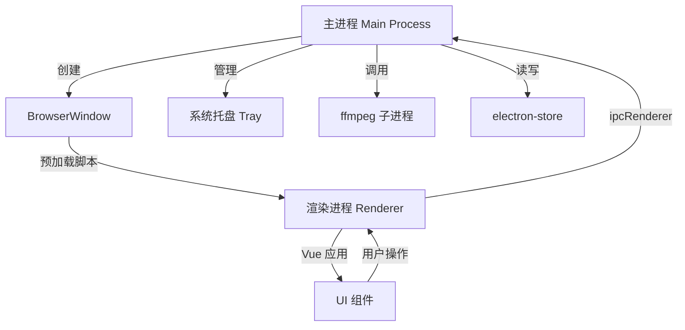

## 产品概述

视频分析工具桌面应用，基于 Electron + Vue3 开发，支持多平台（Windows、MacOS、Linux）。

## 核心功能

- **窗口管理**：多窗口支持、窗口拖拽、缩放、最大化、最小化、关闭、置顶、置底、全屏、还原、最小化到托盘
- **系统托盘**：托盘图标点击打开/关闭窗口、退出应用、显示/隐藏所有窗口（切换）
- **多语言**：中英文切换，默认中文
- **多主题**：暗黑模式、亮色模式、自动模式，默认暗黑模式
- **视频分析**：选择文件/文件夹、设置子目录包含及递归层数、提取音视频文件的音频部分
- **音频转文字**：支持本地 FFmpeg whisper 模块和云端大模型 API 两种方式，用户可选择
- **大模型配置**：设置界面可配置多个大模型的 key、url 等信息，用于语音转文字及文字总结分析
- **进度管理**：记录每个文件的处理进度和状态，支持异常关闭后继续处理

## 技术栈选择

- **构建工具**：electron-vite（基于 Vite 的 Electron 构建工具，支持热更新和 TypeScript）
- **前端框架**：Vue 3 + TypeScript
- **UI 组件库**：Element Plus
- **CSS 方案**：UnoCSS
- **国际化**：vue-i18n
- **状态管理**：Pinia
- **持久化存储**：electron-store（用于配置、进度、状态持久化）
- **音频处理**：ffmpeg（通过 fluent-ffmpeg 或直接调用二进制）
- **语音转文字**：本地 Whisper（ffmpeg 8.0+ 内置）或云端 API（OpenAI Whisper API 等）

## 实施方案

### 项目初始化

使用 Vite 手动初始化项目，集成 Vue3 + TypeScript + Element Plus + UnoCSS，并配置 Electron 主进程。

### 窗口管理实现

在 Electron 主进程中实现窗口管理功能：

- **多窗口**：使用 `BrowserWindow` 创建和管理多个窗口实例，维护窗口列表
- **窗口拖拽**：通过 CSS `-webkit-app-region: drag` 实现自定义标题栏拖拽
- **窗口操作**：调用 BrowserWindow API 实现最小化、最大化、关闭、全屏、还原
- **窗口置顶/置底**：使用 `setAlwaysOnTop(level)` 方法，支持 `normal`、`floating`、`tornoff`、`modal-panel`、`main-menu`、`status`、`pop-up`、`screen-saver` 级别
- **窗口缩放**：默认支持，可通过 `setResizable` 控制最小/最大尺寸

### 系统托盘实现

使用 Electron 的 `Tray` 和 `Menu` API：

- 创建托盘图标，绑定左键点击事件（切换显示/隐藏窗口）
- 右键上下文菜单包含：显示窗口、隐藏窗口、退出应用
- 支持多窗口场景下的批量显示/隐藏

### 多语言实现

使用 `vue-i18n`：

- 创建 `locales/` 目录，存放 `zh-CN.json` 和 `en-US.json`
- 在 Vue 应用中集成 vue-i18n，设置默认语言为中文
- 配合 Element Plus 的语言包（中文 zh-cn、英文 en）实现完整国际化

### 多主题实现

结合 CSS 变量 + Element Plus 暗黑模式：

- 亮色模式：默认 Element Plus 主题
- 暗黑模式：启用 `html.dark` 类名，配合 Element Plus 的 CSS 变量覆盖
- 自动模式：监听 `prefers-color-scheme` 媒体查询，跟随系统主题

### 视频分析核心功能

1. **文件选择**：使用 Electron `dialog.showOpenDialog` 选择文件/文件夹，支持多选
2. **递归遍历**：根据设置的递归层数，使用 Node.js `fs` 模块遍历子目录
3. **音频提取**：使用 ffmpeg 提取视频文件中的音频轨道，输出为 mp3 或 wav 格式
4. **音频转文字**：

- 本地方案：调用 ffmpeg 8.0+ 内置的 whisper 模块进行离线识别
- 云端方案：调用大模型 API（OpenAI Whisper API、文心一言等），支持多种提供商

5. **文字后处理**：调用大模型 API 对转写文本进行总结、分析、整理

### 大模型配置管理

- 设置页面：使用 Element Plus 表单组件创建配置界面
- 支持配置多个大模型（名称、提供商、API Key、API URL、模型名称、温度等参数）
- 使用 electron-store 持久化存储配置，支持导入/导出配置

### 进度跟踪与恢复

- 使用 electron-store 记录每个文件的处理状态（待处理 pending、处理中 processing、已完成 completed、失败 failed）
- 记录处理进度（已处理时长、当前状态、错误信息、输出文件路径等）
- 应用启动时检查未完成任务，提示用户是否继续处理
- 支持断点续传，异常关闭不丢失进度

## 架构设计

### 系统架构

采用 Electron 主进程 + 预加载脚本 + 渲染进程架构：



### 数据流

1. 用户操作 → 渲染进程 → 预加载脚本 → 主进程 → 执行操作（文件处理、窗口操作等）
2. 主进程 → 预加载脚本 → 渲染进程 → 更新 UI（进度更新、状态变更等）

### 模块划分

- **主进程模块**：窗口管理、系统托盘、文件处理、ffmpeg 调用、状态持久化
- **渲染进程模块**：Vue 应用、路由、状态管理、国际化、主题切换、UI 组件

## 目录结构

```
video-analyst/
├── electron/
│   ├── main.ts                      # [NEW] 主进程入口，窗口管理
│   ├── preload.ts                   # [NEW] 预加载脚本，API 桥接
│   ├── tray.ts                      # [NEW] 系统托盘管理
│   └── utils/
│       ├── fileHandler.ts           # [NEW] 文件处理工具（选择、遍历、递归）
│       ├── ffmpeg.ts                # [NEW] ffmpeg 调用封装（音频提取）
│       ├── transcription.ts         # [NEW] 转文字逻辑（本地 Whisper + 云端 API）
│       └── store.ts                 # [NEW] electron-store 封装
├── src/
│   ├── main.ts                      # [NEW] Vue 入口
│   ├── App.vue                      # [NEW] 根组件（路由、主题、i18n 提供）
│   ├── components/
│   │   ├── AppHeader.vue            # [NEW] 自定义标题栏（拖拽、窗口操作按钮）
│   │   ├── FileSelector.vue         # [NEW] 文件/文件夹选择器（拖放、浏览）
│   │   ├── TaskList.vue             # [NEW] 任务列表及进度展示（状态、进度条）
│   │   └── SettingsForm.vue        # [NEW] 大模型配置表单组件
│   ├── views/
│   │   ├── Home.vue                 # [NEW] 首页/视频分析主页面
│   │   └── Settings.vue             # [NEW] 设置页面（语言、主题、LLM 配置）
│   ├── router/
│   │   └── index.ts                 # [NEW] Vue Router 配置
│   ├── store/
│   │   ├── app.ts                   # [NEW] 应用状态（主题、语言、窗口状态）
│   │   └── tasks.ts                 # [NEW] 任务状态管理（Pinia）
│   ├── i18n/
│   │   ├── index.ts                 # [NEW] vue-i18n 配置
│   │   └── locales/
│   │       ├── zh-CN.json           # [NEW] 中文语言包
│   │       └── en-US.json           # [NEW] 英文语言包
│   ├── styles/
│   │   ├── theme.ts                 # [NEW] 主题切换逻辑（dark/light/auto）
│   │   └── index.css                # [NEW] 全局样式、CSS 变量定义
│   ├── utils/
│   │   └── index.ts                 # [NEW] 工具函数（格式化、验证等）
│   └── types/
│       └── index.ts                 # [NEW] TypeScript 类型定义（Task、LLMConfig 等）
├── resources/
│   └── icons/                       # [NEW] 应用图标、托盘图标（多尺寸）
├── .codebuddy/
│   └── plan.md                      # [NEW] 项目计划文档
├── electron.vite.config.ts          # [NEW] electron-vite 配置
├── package.json                     # [NEW] 项目依赖配置
├── tsconfig.json                    # [NEW] TypeScript 根配置
├── tsconfig.web.json                # [NEW] Web 进程 TS 配置
├── tsconfig.node.json               # [NEW] Node 进程 TS 配置
└── vite.config.ts                   # [NEW] Vite 配置（UnoCSS 等）
```

## 实施注意事项

- **性能优化**：ffmpeg 音频提取和转文字是耗时操作，使用子进程避免阻塞主进程；大批量文件处理使用队列机制，限制并发数为 CPU 核心数
- **错误处理**：所有文件操作、API 调用需有完整的 try-catch 和用户提示，记录错误日志
- **依赖升级**：使用 `npm outdated` 检查过期依赖，使用 `npm install <package>@latest` 升级到最新兼容版本，注意检查 breaking changes
- **FFmpeg 集成**：建议将 ffmpeg 二进制文件打包到应用中（使用 ffmpeg-static 或手动下载），确保开箱即用；也可提供首次使用时自动下载功能
- **托盘图标兼容性**：Windows 和 Linux 使用 .ico/.png，macOS 使用 .png（最好提供 16x16、32x32、64x64 多尺寸）
- **多窗口状态同步**：使用 ipcMain/ipcRenderer 进行窗口间通信，保持状态一致

## 设计风格

采用 Element Plus 默认风格，保持简洁实用的界面设计，注重功能性和用户体验。默认暗黑模式，提供专业的桌面应用视觉体验。

## 页面规划（共 2 个核心页面）

### 页面 1：主界面（视频分析页）

- **顶部导航栏（AppHeader）**：自定义标题栏，包含应用图标、标题、窗口操作按钮（最小化、最大化/还原、关闭），支持拖拽移动窗口
- **文件选择区域（FileSelector）**：支持拖放添加文件/文件夹，或点击按钮打开文件选择对话框；显示已选文件/文件夹列表，支持移除
- **处理配置区域**：子目录开关、递归层数输入框（数字）、转文字方式选择（单选：本地 FFmpeg / 云端 API）、选择已配置的大模型
- **任务列表区域（TaskList）**：显示所有任务的文件名称、文件大小、处理状态（用不同颜色区分）、进度条、操作按钮（开始、暂停、取消、查看结果）

### 页面 2：设置页面（Settings）

- **常规设置区块**：语言选择（中文/English）下拉框、主题切换（暗黑/亮色/自动）单选框
- **大模型配置区块**：已配置模型列表（表格或卡片展示），支持添加/编辑/删除操作；配置表单包含：配置名称、提供商（OpenAI/文心一言/本地 Whisper 等）、API Key、API URL、模型名称、温度参数
- **关于区块**：应用名称、版本号、描述信息

## 交互设计

- 窗口操作按钮在鼠标悬停时显示高亮效果（暗黑模式下用浅色背景高亮）
- 任务列表支持按状态筛选（全部、进行中、已完成、失败、待处理）
- 设置页面修改后自动保存到 electron-store，实时生效
- 托盘图标左键点击切换显示/隐藏窗口，右键点击显示上下文菜单
- 处理任务时，任务列表实时更新进度，完成后自动滚动到最新状态